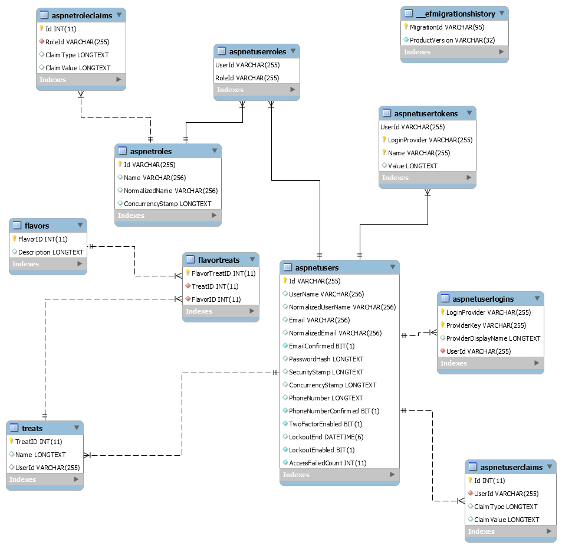

# Pierre's Treats

#### _A web appilication for Pierre's treat shop_

#### By _**Jason Huels**_

## Description
_A web application for Pierre's treat shop, where users can see all treats and flavors, but only logged in user's can create, update and delete treats/flavors_

## Setup/Installation Requirements_
* _Clone this repository_
* _Navigate to the directory_
* _Run "dotnet ef migrations add ???" command (replacing ??? with a unique name)_
* _Run "dotnet ef database update"_
* _Run "dotnet run" command to open application in the command console_
*_See ERD below for how the database should be structured_

## Known Bugs

_N/A_

## Support and contact details

_jasonhuels@yahoo.com_

## Technologies Used

_C#, MySQL, Entity, Identity_

### License

*open source*

Copyright (c) 2019 **_Jason Huels_**
